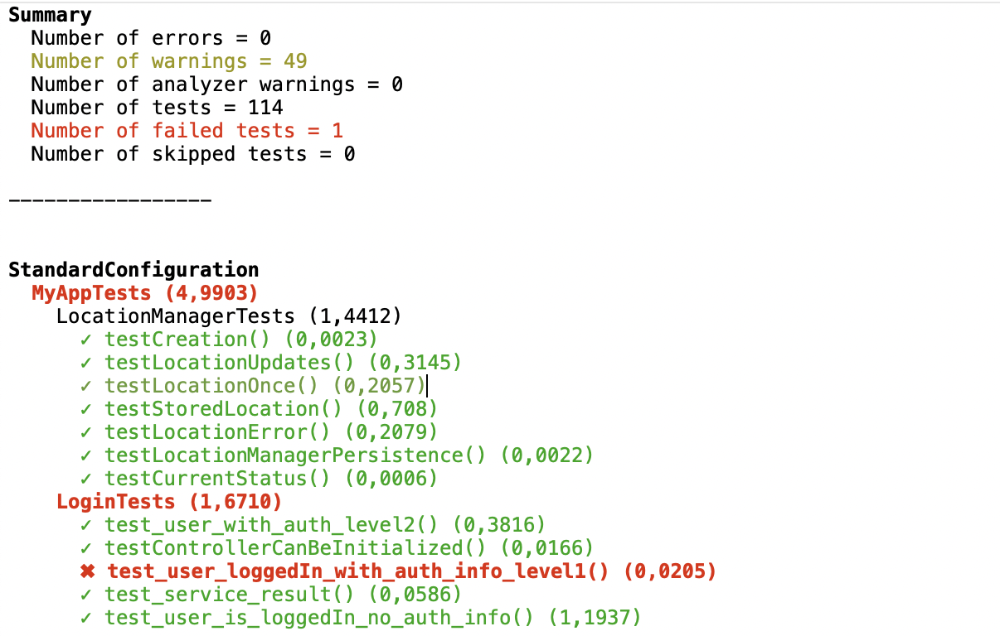
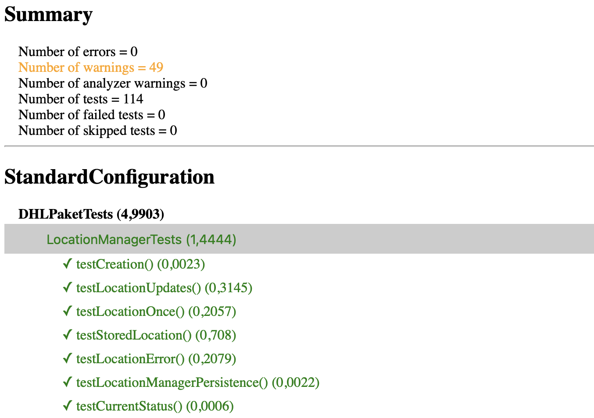

# xcresultparser

## Overview
Parse the binary xcresult bundle from Xcode builds and testruns

Interpret binary .xcresult files and print summary in different formats:
- txt
- colored command line output
- xml
- html

In case of 'xml' JUnit format for test results and generic format (Sonarqube) for coverage data is used.

You can also specify the name of the project root. Paths and urls are then relative to the specified directory. (used for urls in xml output)

This tool can read test result data and code coverage data from an .xcarchive using the developer tools included in `Xcode 11`. Namely here: xcresulttool and xccov to get json data from .xcresult bundles.

Parsing the JSON is done using the great [XCResultKit](https://github.com/davidahouse/XCResultKit) package.

## Converting code coverage data
Unfortunately converting to the coverage xml format suited for e.g. sonarqube is a tedious task.
It requires us to invoke the xccov binary for each single file in the project.

First we get a list of source files with coverage data from the archive, using xccov --file-list
and then we need to invoke xccov for each single file. That takes a considerable amount of time.
So at least we can spread it over different threads, so that it executes in parallel and is overall faster.

Until now we used [xccov-to-sonarqube-generic.sh]( https://github.com/SonarSource/sonar-scanning-examples/blob/master/swift-coverage/swift-coverage-example/xccov-to-sonarqube-generic.sh)
which does the same job, just in a shell script. It has the same problem
and since it can not spawn it to different threads, it takes about 5x the time.

## How to get it
- Download the `xcresultparser` binary from the latest [release](https://github.com/a7ex/xcresultparser/releases/latest/xcresultparser.zip)
- [zwei](https://github.com/a7ex/xcresultparser/releases/download/latest/xcresultparser.zip)
- Copy `xcresultparser` to your desktop
- Open a Terminal window and run this command to give the app permission to execute:

```
chmod +x ~/Desktop/xcresultparser
```

Or build the tool in Xcode yourself:

- Clone the repository / Download the source code
- Build the project
- Open a Finder window to the executable file

- Drag `xcresultparser` from the Finder window to your desktop

## How to install it
Assuming that the `xcresultparser` app is on your desktop…

Open a Terminal window and run this command:
```
cp ~/Desktop/xcresultparser /usr/local/bin/
```
Verify `xcresultparser` is in your search path by running this in Terminal:
```
xcresultparser
```
You should see the tool respond like this:
```
Error: Missing expected argument '<xcresult-file>'

OVERVIEW: Interpret binary .xcresult files and print summary in different formats: txt, xml, html or colored cli output.

USAGE: xcresultparser [--output-format <output-format>] [--project-root <project-root>] [--coverage ...] [--version ...] [--quiet ...] <xcresult-file>

ARGUMENTS:
<xcresult-file>         The path to the .xcresult file. 

OPTIONS:
-o, --output-format <output-format>
The output format. It can be either 'txt', 'cli', 'html' or 'xml'. In case of 'xml' JUnit format for test results and generic format (Sonarqube) for coverage data
is used. 
-p, --project-root <project-root>
The name of the project root. If present paths and urls are relative to the specified directory. 
-c, --coverage          Whether to print coverage data. 
-v, --version           Print version. 
-q, --quiet             Quiet. Don't print status output. 
-h, --help              Show help information.
```
Now that a copy of `xcresultparser` is in your search path, delete it from your desktop.

You're ready to go! 🎉

## How to use it
The tool doesn't create any file. It justs outputs its results to standard out. It is up to you to write the output to a file, using redirection.
For example, if you want to write the text output into a file named `output.txt` on your desktop:
```
./xcresultparser -o txt test.xcresult > ~/Desktop/output.txt
```

## Examples
### Colored CLI output
Print the test results in color to the command line:
```
./xcresultparser -o cli test.xcresult
```


### HTML output
Create a single html file with test data
```
./xcresultparser -o html test.xcresult > testResult.html
```


### Junit output
Create an xml file in JUnit format:
```
./xcresultparser -o xml test.xcresult > junit.xml
```

### Sonarqube output
Create an xml file in generic code coverage xml format:
```
./xcresultparser -c -o xml test.xcresult > sonar.xml
```
